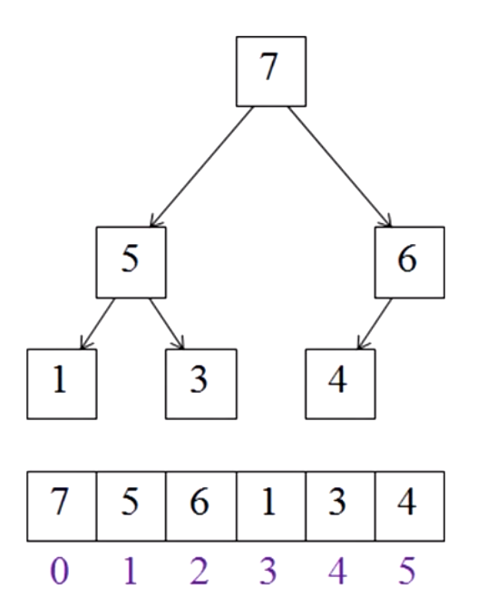

# Ejercicios Algoritmos

1. Factoreando Números:
	Se acuerdan como factoreaban números en la escuela? Hagamos un algoritmo para eso! Hay que seguir estos pasos:
	1. Empezamos intentando dividir el número en dos, si el resto es cero, lo seguimos haciendo hasta que no sea cero. En cada pasa agregamos el número como factor.
	2. Pasamos a el siguiente factor que no sea divisible con ningún anterior (en la segunda pasada seria el tres) y dividimos, si el resto es cero, lo agregamos como factor, si no, pasamos al siguiente factor.
	3. Realizar el paso 2 hasta que el próximo factor sea mayor que la raíz cuadrada del número que nos queda.

	- ¿Cómo implementarian este algoritmo?
	- ¿Funciona bien? Comparen con los resultados de sus compañeros.
	- ¿Qué complejidad tiene el algoritmo que escribieron? ¿Lo pueden mejorar?

2. BubbleSort:
	* Implementar el algoritmo BubbleSort.
	* Agregen funcionalidad para poder medir el tiempo que tarda en ordenar.
	* ¿Como podemos reducir el tiempo? Buscar mejoras de BubbleSort.


2. InsertionSort
	* Implementar el algoritmo InsertionSort usando:
		* Arreglos.
		* Listas Enlazadas (extra-Credit)
	* Agregen funcionalidad para poder medir el tiempo que tarda en ordenar.
	* Calculen la complejidad de ambas implementaciones.

3. SelectionSort
	* Implementar el algoritmo en:
		* Dos Arreglos
		* Un sólo arreglo
		* Listas Enlazadas (extra-Credit)
	* Agregen funcionalidad para poder medir el tiempo que tarda en ordenar.
	* Calculen la complejidad de ambas implementaciones.	

4. QuickSort
	* Implementa el algoritmo usando este pseudocódigo:

		```
		1. Elegí un pivot entre los elementos.
		2. Marca con un puntero el primer item del arreglo
		3. Marca con otro puntero el último item del arreglo
		4. Mientras el valor del puntero izquierdo sea menor que el pivot, mové el puntero a la derecha (por uno). Continuar hasta que el valor dentro del puntero sea mayor o igual que pivot.
		5. Mientras que el puntero de la derecha sea mayor que el piver, mové el puntero derecho hacia la izquierda. Continuar hasta que el valor dentro del puntero derecho sea menor o igual que el pivote.pivot value.
		6. Si el puntero izquierdo es menor o igual que el puntero derecho, entonces intercambia sus valores.
		7. Move el puntero izquierdo a la derecha en uno, y el derecho a la izquierda en uno.
		8. Continuá haciendo esto hasta que los punteros se cruzen.
		9. Realizá de nuevo estos pasos con cada particion que queda.
		```

		* 
		* 

## Extra Credit

5. HeapSort
	* Implementa el algoritmo en:
		* Un árbol binario
		* En un arreglo (recuerden como guardar árboles binarios en un arreglo)
		

6. BFS y DFS:
	* Implementar un algoritmo para recorrer un árbol de las dos formas.
	* Usar el algoritmo implementado para poder buscar un elemento dentro del árbol.

## Recursión:

1. Implementar una función recursiva para calcular el factorial de un número entero.
	- Prueben hasta que número pueden llegar a calcular con su función sin reventar la pila de ejecución.
	- Compartan con sus compañeros hasta cuantas llamadas pudieron hacer. Las pueden ir contando?
	- Calculen el orden de complejidad de nuestra función.
